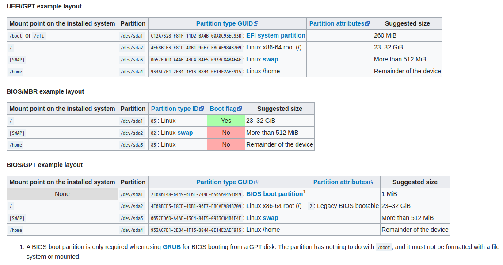

# 系统安装中出现问题的汇总

## 1. 分区时出现警告：逻辑分区和物理分区不对齐

- 可能原因：SSD或者是HDD上原来装过Windows，则硬盘最开始的32M空间（图形界面下使用`Gparted`可以看到）是默认空白的。这样就会导致分区的不对齐。但其实对于SSD来说只是影响到速度，使用还是比较正常的

- 解决方法：

  - （未试验）使用`shred`命令彻底清洗磁盘，但耗时一般较长。

    ```bash
    $ shred -v /dev/sda
    ```

## 2. 关于`grub`和分区

- Arch Linux支持三种启动方式，但启动方式分区和`grub`的安装略有不同。

  1. `UEFI + GPT`

     这是我采用的方式。具体对于`grub`的操作见[上文](system-installation.md/#4-硬盘分区)。

     较新的主板推荐采用这种方式。

  2. `BIOS + MBR`

     这是较老的主板支持的分区方式，但在某些新的主板上已经不支持了。值得注意的是这种分区方式支持的硬盘是小于`2T`的。

  3. `BIOS + GPT`

     个人感觉这种分区方法的好处是方便后续在这块硬盘上安装别的Linux发行版并提高设备的兼容性。因为最好保证一块硬盘的分区表前后都是一致的，否则会出现兼容性的问题（这是我的猜想，有错误还请指正）。

- 三种分区方式具体如下图：

  

- 三种分区方式及后续挂载方式等的完整命令示例：

  - `UEFI + GPT`

    ```bash
    # 进入磁盘编辑
    $ fdisk /dev/sda   # /dev/sda为磁盘设备的位置
    $ g   # 清除原有分区并创建一个GPT分区表
    $ n   # 创建一个新的分区/dev/sda1 -- 引导分区
    $ n   # 创建一个新的分区/dev/sda3 -- SWAP分区（用于保存内存中的文件以及作为内存的扩展，此
          # 分区不需要太大）
          # 这里我大小设置为1G
    $ n   # 创建一个新的分区/dev/sda2 -- 主分区
          # 大小我设置为磁盘的所有剩余空间
    $ p   # 查看待写入的分区结果
    $ w   # 写入
    
    # 制作文件系统
    # 这里会出现一些关于磁盘性能的警告，不用特别在意。
    $ mkfs.fat -F32 /dev/sda1   # /dev/sda1为引导分区，制作为“fat32”格式
    $ mkfs.ext4 /dev/sda2       # /dev/sda2为主分区，制作为“ext4”格式
    $ mkswap /dev/sda3          # /dev/sda3为SWAP分区
    
    # 打开swap
    $ swapon /dev/sda3
    
    # 挂载
    $ mount /dev/sda2 /mnt        # 挂载主分区
    $ mkdir /mnt/boot             # 创建启动分区在Live CD上的目录
    $ mount /dev/sda1 /mnt/boot   # 挂载启动分区
    
    # 安装Linux所需的最基础的软件、框架等
    $ pacstrap /mnt base linux linux-firmware
    
    # 生成挂载文件
    $ genfstab -U /mnt >> /mnt/etc/fstab
    
    # 使用arch-chroot
    $ arch-chroot /mnt
    
    # 安装grub相关
    $ pacman -S grub efibootmgr intel-ucode os-prober
    # intel-ucode   厂家更新CPU驱动用，如果是AMD的显卡，则安装amd-ucode
    # os-probe      用来寻找电脑中其他操作系统
    $ mkdir /boot/grub
    $ grub-mkconfig > /boot/grub/grub.cfg                      # 生成grub配置文件
    $ uname -m                                                 # 查看系统架构
    $ grub-install --target=x86_64-efi --efi-directory=/boot   # 根据自己的系统架构安装                                                            # grub,我这里系统架构是                                                            # x86_64，所以选择安装                                                            # x86_64-efi
    ```

  - `BIOS + MBR`

    ```bash
    # 进入磁盘编辑
    $ fdisk /dev/sda   # /dev/sda为磁盘设备的位置
    $ o   # 清除原有分区并创建一个MBR分区表
    $ n   # 创建一个新的分区/dev/sda1 -- 主分区
    $ n   # 创建一个新的分区/dev/sda2 -- SWAP分区（用于保存内存中的文件以及作为内存的扩展，此
          # 分区不需要太大）
          # 这里我大小设置为1G
    $ n   # 创建一个新的分区/dev/sda3 -- /home分区
          # 大小我设置为磁盘的所有剩余空间
    $ p   # 查看待写入的分区结果
    $ w   # 写入
    
    # 制作文件系统
    # 这里会出现一些关于磁盘性能的警告，不用特别在意。
    $ mkfs.ext4 /dev/sda1   # /dev/sda1为主分区，制作为“ext4”格式
    $ mkswap /dev/sda2      # /dev/sda2为SWAP分区
    $ mkfs.ext4 /dev/sda3   # /dev/sda3为/home分区，制作为“ext4”格式
    
    # 打开swap
    $ swapon /dev/sda2
    
    # 挂载
    $ mount /dev/sda1 /mnt        # 挂载主分区
    $ mkdir /mnt/home             # 创建/home分区在Live CD上的目录
    $ mount /dev/sda3 /mnt/home   # 挂载/home分区
    
    # 安装Linux所需的最基础的软件、框架等
    $ pacstrap /mnt base linux linux-firmware
    
    # 生成挂载文件
    $ genfstab -U /mnt >> /mnt/etc/fstab
    
    # 使用arch-chroot
    $ arch-chroot /mnt
    
    # 安装grub相关
    $ pacman -S grub intel-ucode os-prober
    # intel-ucode   厂家更新CPU驱动用，如果是AMD的显卡，则安装amd-ucode
    # os-probe      用来寻找电脑中其他操作系统
    $ mkdir /boot/grub
    $ grub-mkconfig > /boot/grub/grub.cfg      # 生成grub配置文件
    $ grub-install --target=i386-pc /dev/sda   # 敲入这条命令即可，使用BIOS的在grub-                                              # install时--target参数统一是i386-pc
                                               # 值得注意的是，这里grub安装的位置选择的直                                            # 接是硬盘/dev/sda，而不是任何一个分区
    ```

  - `BIOS + GPT`

    ```bash
    # 进入磁盘编辑
    $ fdisk /dev/sda   # /dev/sda为磁盘设备的位置
    $ g   # 清除原有分区并创建一个GPT分区表
    $ n   # 创建一个新的分区/dev/sda1 -- 空白分区，大小为1M
    $ n   # 创建一个新的分区/dev/sda2 -- 主分区
    $ n   # 创建一个新的分区/dev/sda3 -- SWAP分区（用于保存内存中的文件以及作为内存的扩展，此
          # 分区不需要太大）
          # 这里我大小设置为1G
    $ n   # 创建一个新的分区/dev/sda4 -- /home分区
          # 大小我设置为磁盘的所有剩余空间
    $ p   # 查看待写入的分区结果
    $ w   # 写入
    
    # 制作文件系统
    # 这里会出现一些关于磁盘性能的警告，不用特别在意。
    # 注意这里的/dev/sda1空白分区不需要挂载，也不需要制作文件系统。
    $ mkfs.ext4 /dev/sda2   # /dev/sda2为主分区，制作为“ext4”格式
    $ mkswap /dev/sda3      # /dev/sda2为SWAP分区
    $ mkfs.ext4 /dev/sda4   # /dev/sda4为/home分区，制作为“ext4”格式
    
    # 打开swap
    $ swapon /dev/sda3
    
    # 挂载
    $ mount /dev/sda2 /mnt        # 挂载主分区
    $ mkdir /mnt/home             # 创建/home分区在Live CD上的目录
    $ mount /dev/sda4 /mnt/home   # 挂载/home分区
    
    # 安装Linux所需的最基础的软件、框架等
    $ pacstrap /mnt base linux linux-firmware
    
    # 生成挂载文件
    $ genfstab -U /mnt >> /mnt/etc/fstab
    
    # 使用arch-chroot
    $ arch-chroot /mnt
    
    # 安装grub相关
    $ pacman -S grub intel-ucode os-prober
    # intel-ucode   厂家更新CPU驱动用，如果是AMD的显卡，则安装amd-ucode
    # os-probe      用来寻找电脑中其他操作系统
    $ mkdir /boot/grub
    $ grub-mkconfig > /boot/grub/grub.cfg              # 生成grub配置文件
    $ grub-install --force --target=i386-pc /dev/sda
    # 敲入这条命令即可，使用BIOS的在grub-install时--target参数统一是i386-pc
    # 这里也需要使用--force参数强制安装grub，因为无参数情况下的两个警告会使得grub安装失败
    # 值得注意的是，这里grub安装的位置选择的直接是硬盘/dev/sda，而不是任何一个分区
    ```

  - 如果还有问题，请移步`Arch Wiki`：

    <https://wiki.archlinux.org/index.php/Partitioning#GUID_Partition_Table>

    <https://wiki.archlinux.org/index.php/GRUB>

    <https://wiki.archlinux.org/index.php/Partitioning>